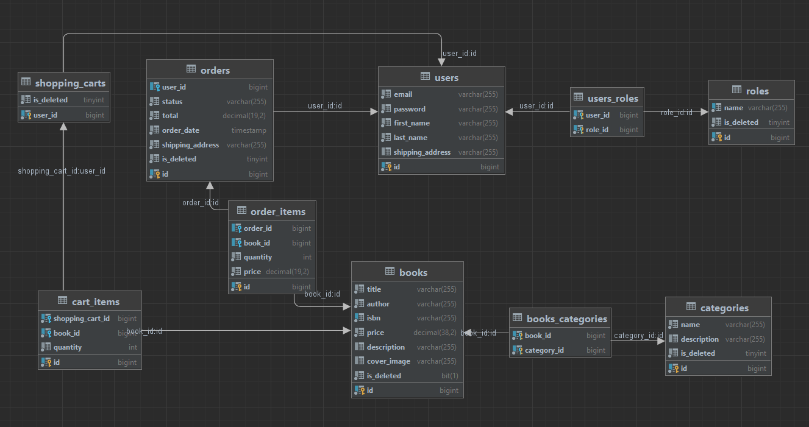

# Online Book Store

The Online Book Store is a backend application developed in Java using the Spring framework.
It provides a RESTful API for managing books, categories, shopping carts, and orders in an online bookstore.
This application supports CRUD (Create, Read, Update, Delete) operations, advanced book search by defined criteria, and role-based functionality for users and administrators.

## Technologies and tools

- **Spring Boot** - 
A framework simplifies the configuration and customization of the application, allowing to quickly start development.
- **Spring Security** - Ensures secure access to the API through authorization and authentication.
- **Spring Data JPA** - A part of the Spring ecosystem that simplifies data management using Java Persistence API.
- **MySQL** - Used as the database in the production environment.
- **Swagger** - Automatically generates API documentation.
- **Docker** - Platform for application containerization.
- **Liquibase** - Manages database migrations and schema versioning.

## Functionalities of controllers
### Authentication controller
| HTTP Request | Endpoint         | Description            |
|--------------|------------------|------------------------|
| POST         | `/auth/register` | Register a new user    |
| POST         | `/auth/login`    | Login an existing user |

### Book controller
| HTTP Request | Endpoint        | Description                                          |
|--------------|-----------------|------------------------------------------------------|
| GET          | `/books`        | Get a list of all available books                    |
| POST         | `/books`        | Create a new book and save it to the DB              |
| GET          | `/books/search` | Search books by specific parameters (authors/titles) |
| GET          | `/books/{id}`   | Get one book according to its ID                     |
| PUT          | `/books/{id}`   | Update an existing book from DB by its ID            |
| DELETE       | `/books/{id} `  | Delete one book from DB according to its ID          |

### Category controller
| HTTP Request | Endpoint                 | Description                               |
|--------------|--------------------------|-------------------------------------------|
| POST         | `/categories`            | Create a new category                     |
| GET          | `/categories`            | Get a list of all categories              |
| GET          | `/categories/{id}`       | Get one category according to its ID      |
| PUT          | `/categories/{id}`       | Update an existing category by its ID     |
| DELETE       | `/categories/{id}`       | Delete one category according to its ID   |
| GET          | `/categories/{id}/books` | Get list of books by specific category ID |

### Order controller
| HTTP Request | Endpoint                           | Description                            |
|--------------|------------------------------------|----------------------------------------|
| POST         | `/orders`                          | Place order using shipping address     |
| GET          | `/orders`                          | Get all users orders                   |
| PATCH        | `/orders/{id}`                     | Update orders status by its ID         |
| GET          | `/orders/{orderId}/items/{itemId}` | Get order item by its ID and orders ID |
| GET          | `/orders/{orderId}/items`          | Get order items by orders ID           |

### Shopping cart controller
| HTTP Request | Endpoint           | Description                                      |
|--------------|--------------------|--------------------------------------------------|
| GET          | `/cart`            | Get a content of shopping cart                   |
| POST         | `/cart`            | Add book to shopping cart                        |
| PUT          | `/cart/items/{id}` | Update quantity of one specific book in the cart |
| DELETE       | `/cart/items/{id}` | Delete cart item from users shopping cart        |

## Database structure:

## Configuration and launch

To set up and run the project, please do the following:
1. Install [Docker](https://www.docker.com/products/docker-desktop/) and run.
2. Download or clone the project from GitHub repository.
3. Set the necessary settings in *.env* file. You can use *.env.example* file as a hint.
4. Build the project by command `mvn clean install`.
5. Run the command `docker-compose up --build` to build and launch containers.
6. Access the Swagger UI at http://localhost:8081/swagger-ui/index.html and test the application any way you want!